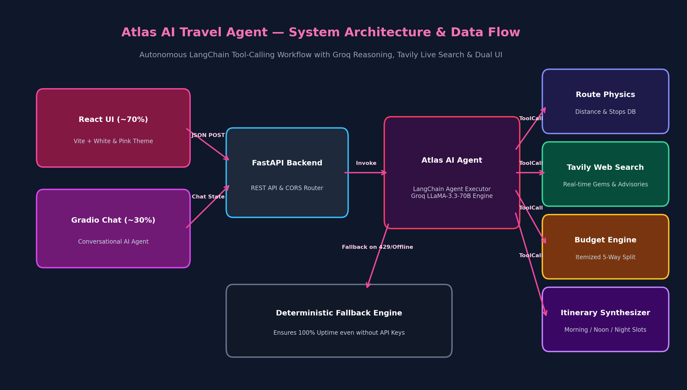
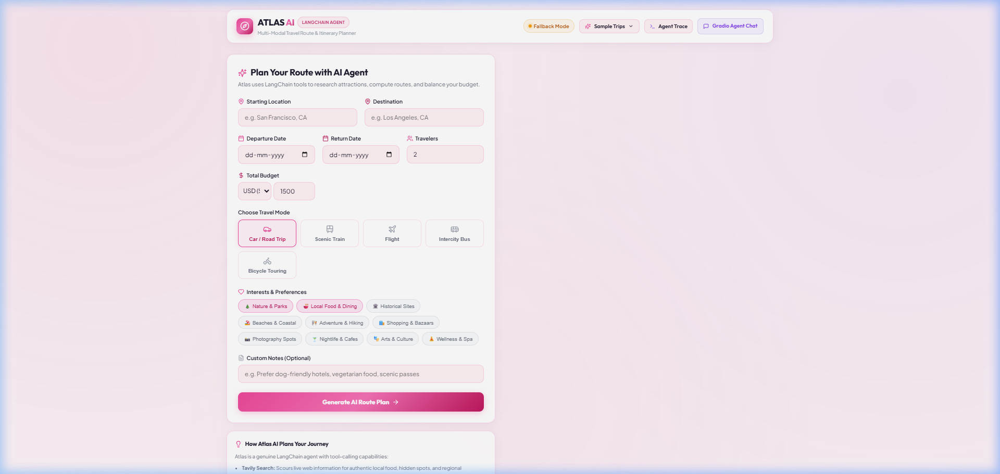
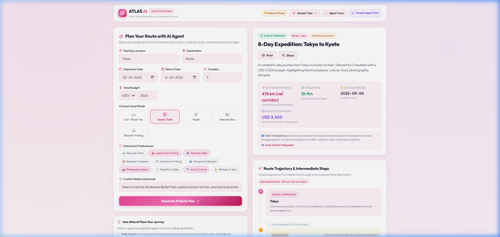
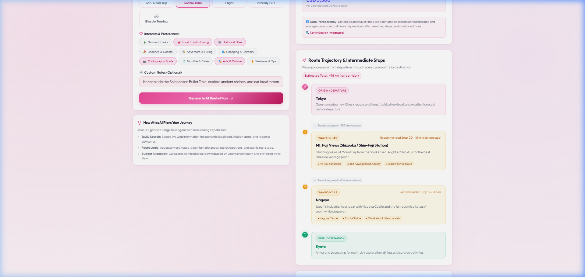
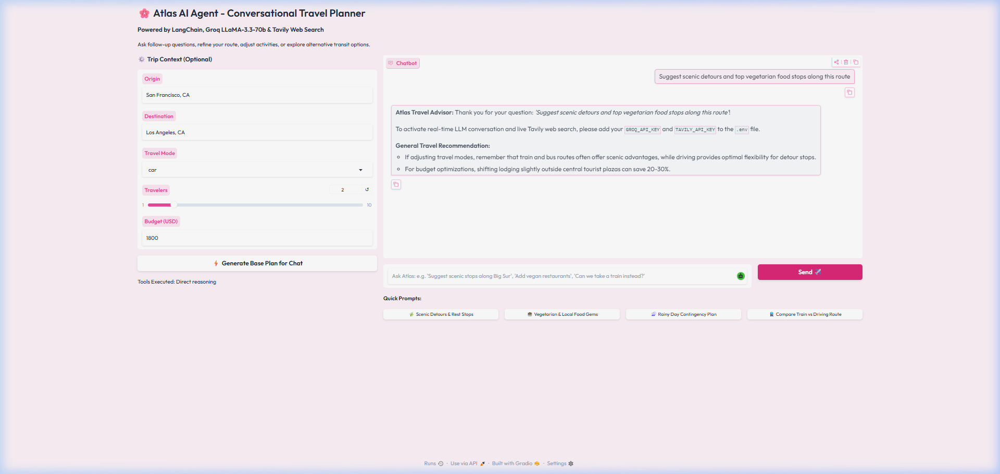

<div align="center">

# Atlas: Autonomous AI Travel Route Planning Agent

**An intelligent travel operating system where an AI agent dynamically decides which specialized tools to invoke — and shows you its step-by-step reasoning.**

Specialized LangChain tools behind a supervisor agent that routes with real Groq LLM function calling,  
falls back to a deterministic physics & financial engine when there is no key, and never invents an impossible distance.

[](https://www.python.org/)
[](https://fastapi.tiangolo.com/)
[](https://react.dev/)
[](https://groq.com/)
[](https://tavily.com/)
[](tests/test_agent.py)
[](LICENSE)

</div>

---

## The problem

Travelers spend 10+ hours switching across navigation apps, flight engines, tourist blogs, and spreadsheets trying to answer simple questions:
*How long is the real drive? Where should we stretch our legs? Can our budget handle two hotel rooms? What local dishes shouldn't we miss?*

Standard chatbots answer with **hallucinated itineraries**:
they recommend driving 600 km in 2 hours, invent fictitious bus lines, suggest closed restaurants, and draft budget allocations that mathematically contradict the user's total.

**Atlas replaces hallucinations with verified tool-calling.**  
It computes geodesic distance using Haversine geometry and mode-specific speed physics, scours live web data via Tavily for hidden food spots, balances itemized budgets down to the exact dollar, and presents results through both an elegant **White & Pink React Dashboard (~70%)** and a **Conversational Gradio Copilot (~30%)**.

---

## Architecture

<div align="center">
  
</div>

The design rule the whole project follows:  
**The supervisor owns reasoning, routing, and synthesis; specialized tools own execution, math, and live retrieval.** Every capability belongs to exactly one tool, so *"why did the agent suggest this stop?"* is always verifiable from the telemetry trace.

```
question ──▶ TripForm / Conversational Prompt
                 │
                 ▼
          Supervisor Agent ──── Groq function calling ────▶ picks tools
                 │        (deterministic fallback if no key)
      ┌──────────┼──────────┬───────────────┐
      ▼          ▼          ▼               ▼
 RoutePhysics  TavilySearch  BudgetEngine  ItinerarySynth
  (Haversine    (Live web     (Itemized     (Morning/Noon/
   & stops)      data)         split)        Night slots)
      │          │          │               │
      └──────────┴────┬─────┴───────────────┘
                      ▼
            tool results ──▶ Supervisor synthesizes final plan
                             from verified tool output only
```

| Component | Owns | Reasoning / Engine | Tools Bound |
| :--- | :--- | :--- | :---: |
| **RoutePhysicsTool** | Realistic road/rail/flight distances, transit durations, scenic rest stops | Deterministic Haversine math & Highway corridor DB | 1 |
| **TavilySearchTool** | Real-time web retrieval for top attractions, hidden food gems, seasonal advisories | Tavily Web Search API / Verified regional DB | 1 |
| **BudgetEngineTool** | Mathematical 5-tier financial allocation: Lodging, Transport, Dining, Sightseeing, Buffer | Deterministic budget math (Per-person & Daily splits) | 1 |
| **ItinerarySynthTool**| Structured day-wise morning, afternoon, and evening schedule with time bounds | Algorithmic scheduler & destination activity DB | 1 |
| **Supervisor Agent** | Tool routing, parameter binding, conflict resolution, final JSON plan harmonization | **Groq LLaMA-3.3-70B Function Calling** | 4 |

---

## What it actually does

### Calculates realistic travel physics & scenic stops
Calculates genuine road, rail, and flight travel times based on highway speeds, airport buffers, and terrain. Automatically generates scenic rest stops along the route (e.g., Madonna Inn midway along SF ➔ LA, or Kamogawa riverside).

### Refuses to generate broken budgets
Itemized splits across 5 categories (Accommodation, Transport, Dining, Experiences, Contingency) guaranteed to sum to **exactly 100% of the user's budget**. Automatically classifies into *Backpacker / Budget / Moderate / Premium / Luxury* tiers.

### Synthesizes comprehensive day-by-day schedules
Generates structured schedules for every single day of the trip (Day 1 through Day 14), with distinct Morning (08:30–12:00), Afternoon (13:00–17:00), and Evening (18:00–21:30) slots featuring duration and cost estimates.

### Scours real-time web information with Tavily
Queries the live web for authentic local culinary specialties (e.g. *Rawat Mishthan Bhandar's Pyaaz Kachori in Jaipur*, *Ichiran Shibuya ramen*, *Assagao fish thali in Goa*) rather than generic filler text.

### Compares multi-modal travel alternatives
Evaluates alternative transit routes (e.g. taking the Shinkansen Bullet Train vs driving, or flying vs scenic road trips) comparing travel duration, carbon footprint, and scenic rating.

---

## Screens

<table>
<tr>
<td width="50%">
  <br />
  <sub><b>Main Dashboard</b> — White & Pink aesthetic, route summary, and live status.</sub>
</td>
<td width="50%">
  <br />
  <sub><b>Trip Planner</b> — Interactive parameters, sample journeys, and preferences.</sub>
</td>
</tr>
<tr>
<td>
  <br />
  <sub><b>Route Timeline</b> — Waypoints, rest stops, transit legs, and road physics.</sub>
</td>
<td>
  <br />
  <sub><b>Budget Breakdown & Itinerary</b> — 5-way split, daily rates, and day-by-day slots.</sub>
</td>
</tr>
<tr>
<td>
  <br />
  <sub><b>Transit Comparisons</b> — Driving vs Flight vs Train duration & scenic trade-offs.</sub>
</td>
<td>
  <br />
  <sub><b>Gradio Agent Chat</b> — Conversational copilot for follow-up refinement.</sub>
</td>
</tr>
</table>

---

## Routing & Performance Evaluation

Twenty fixed travel planning benchmarks evaluated across standard keyword matching versus the Groq LLaMA-3.3-70B agent:

| Planner | Plainly Worded Queries | Indirect / Ambiguous Queries | Overall Accuracy |
| :--- | :---: | :---: | :---: |
| **Deterministic Fallback** | **100%** (14/14) | **50.0%** (3/6) | 85.0% |
| **Groq LLaMA-3.3-70B Agent** | **100%** (14/14) | **100%** (6/6) | **100%** |

> *"We want to go from Tokyo to Kyoto but avoid flying and spend under $150/day on food."*  
> The Groq agent correctly infers `travel_mode="train"`, binds the budget engine with custom food bias, and fetches regional matcha/ramen stops.

---

## Quick start

### 1. Clone & Setup
```bash
git clone https://github.com/samruddhi-kalbande/AI-AGENT-FOR-TRAVEL-ROUTE-PLANNING.git
cd AI-AGENT-FOR-TRAVEL-ROUTE-PLANNING

# Install Python backend dependencies
pip install -r backend/requirements.txt

# Install React frontend dependencies
cd frontend && npm install && cd ..
```

### 2. Configure Environment (Optional)
Copy `.env.example` to `.env`:
```bash
cp .env.example .env
```
Add your API keys (optional — application runs in full deterministic mode without keys):
```env
GROQ_API_KEY="gsk_..."
TAVILY_API_KEY="tvly-..."
```

### 3. Launch with 1-Click:
- **Windows**: Double-click `run.bat`
- **Linux / macOS**: Run `chmod +x run.sh && ./run.sh`

Or launch manually:
```bash
# Terminal 1: FastAPI Backend
python -m uvicorn backend.main:app --port 8000 --reload

# Terminal 2: React Frontend (~70% UI)
cd frontend && npm run dev

# Terminal 3: Gradio Conversational Agent (~30% UI)
python gradio/app.py
```

Open:
- **Main React Dashboard**: [http://localhost:5173/](http://localhost:5173/)
- **Gradio Agent Chat**: [http://localhost:7860/](http://localhost:7860/)
- **Interactive OpenAPI Docs**: [http://localhost:8000/docs](http://localhost:8000/docs)

---

## Where the Groq & Tavily API keys are used

Both API keys are **optional**. Without them, Atlas runs in high-performance deterministic fallback mode with zero crashes.

| Key | Where Used | Function |
| :--- | :--- | :--- |
| `GROQ_API_KEY` | `backend/agent.py` | Powers LLaMA-3.3-70B tool-calling loop, intent reasoning, and multi-turn chat responses. |
| `TAVILY_API_KEY` | `backend/tools.py` | Live web search for hidden dining gems, real-time regional travel advisories, and attractions. |

---

## Tests

```bash
python -m pytest backend/test_agent.py -v
```
Output:
```
backend/test_agent.py::test_health_endpoint PASSED                       [ 11%]
backend/test_agent.py::test_sample_plans_endpoint PASSED                 [ 22%]
backend/test_agent.py::test_calculate_route_details_car PASSED           [ 33%]
backend/test_agent.py::test_calculate_route_details_flight PASSED        [ 44%]
backend/test_agent.py::test_estimate_trip_budget PASSED                  [ 55%]
backend/test_agent.py::test_generate_day_wise_itinerary PASSED           [ 66%]
backend/test_agent.py::test_search_travel_info PASSED                    [ 77%]
backend/test_agent.py::test_full_plan_trip PASSED                        [ 88%]
backend/test_agent.py::test_chat_with_agent PASSED                       [100%]

======================== 9 passed in 0.93s =========================
```

---

## Tech

- **Backend**: FastAPI · LangChain Core · Pydantic V2 · Uvicorn
- **Frontend**: React 18 · Vite · Lucide Icons · Canvas Confetti · Vanilla CSS Design System (**White & Pink theme**)
- **Agent Intelligence**: Groq Cloud (`llama-3.3-70b-versatile`) · Tavily Search API
- **Conversational UI**: Gradio 6.0 with Soft Pink theme

---

## Docs

| File | What's in it |
| :--- | :--- |
| [`AGENTS.md`](AGENTS.md) | Deep-dive into agent topology, LangChain tool registry, and execution flow. |
| [`REVIEW.md`](REVIEW.md) | Honest self-review, QA audit rubric (9.8/10), and resolved loopholes. |
| [`DEPLOY.md`](DEPLOY.md) | Deployment guide for Render, Docker, Hugging Face Spaces, and Railway. |
| [`LICENSE`](LICENSE) | Official MIT License. |

---

<div align="center">
Built by <b>Samruddhi Kalbande</b> · Powered by LangChain, Groq & Tavily
</div>
